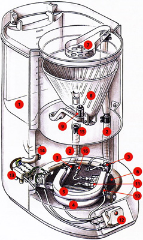

# 私有的和受保护的属性和方法

面向对象编程最重要的原则之一——划分出外部接口和内部接口。

在开发比 “hello world” 应用更复杂的东西时，这是“必须”的做法。

为了理解这一点，让我们脱离开发过程，把目光转向现实世界。

通常，我们使用的设备非常复杂。但是划分出外部接口和内部接口可以让我们使用它们而没有任何问题。

## 一个真实的例子

例如咖啡机。从外面看很简单：一个按钮，一个显示器，几个洞……当然，结果就是——很棒的咖啡！:)


但在里面……（维修手册中的图片）



有很多细节。但我们可以在不了解的情况下使用它。

咖啡机非常可靠，不是吗？我们可以使用好几年，只有在出现问题时——进行维修。

咖啡机的可靠性和简洁性的秘诀——所有细节都经过精心调整并 *隐藏* 在内部。

如果我们从咖啡机上取下保护盖，那么使用它将会复杂得多（要按哪里？），并且危险（会触电）。

正如我们所看到的，在编程中，对象就像咖啡机。

但是为了隐藏内部细节，我们不会使用保护盖，而是使用语言和惯例中的特殊语法。

## 内部接口和外部接口

在面向对象的编程中，属性和方法分为两组：

- *内部接口* —— 可以通过类的其他方法访问，但不能从外部访问的方法和属性。
- *外部接口* —— 也可从类的外部访问的方法和属性。

如果我们继续用咖啡机进行类比——内部隐藏的内容：锅炉管，加热元件等——是其内部的接口。

内部接口用于对象，它的细节相互使用。例如，锅炉管连接到加热元件。

但是从外面看，咖啡机内部被保护罩遮住，所以没有人可以接触到。细节被隐藏起来并且无法访问。我们可以通过外部接口使用它的功能。

所以，我们需要使用一个对象时只需知道它的外部接口。我们可能完全不知道它的内部是如何工作的，这很棒。

这是个概括的介绍。

在 JavaScript 中，有两种类型的对象字段（属性和成员）：

- 公共的：可从任何地方访问。它们包含外部接口。直到现在我们只使用公共属性和方法。
- 私有的：只能从类的内部访问。这些用于内部接口。

在许多其他语言中，还存在“受保护”的字段：只能从类的内部访问和扩展它们（类似私有的，但是加上了向继承的类的访问）。它们对内部接口也很有用。它们在某种意义上比私有的属性和方法更广泛，因为我们通常希望继承类来获得正确执行扩展的访问权限。

受保护的字段不是在语言级别的 Javascript 中实现的，但实际上它们非常方便，因此它们是模拟（这里求校对）的。

现在，我们将使用所有这些类型的属性在 Javascript 中制作咖啡机。咖啡机有很多细节，我们不会对它们进行全面模拟以保持简洁（尽管我们可以）。

## 受保护的 “waterAmount”

让我们先做一个简单的咖啡机类：

```js run
class CoffeeMachine {
  waterAmount = 0; // 内部的水量

  constructor(power) {
    this.power = power;
    alert( `Created a coffee-machine, power: ${power}` );
  }

}

// 创建咖啡机
let coffeeMachine = new CoffeeMachine(100);

// 加入水
coffeeMachine.waterAmount = 200;
```

现在，属性 `waterAmount` 和 `power` 是公共的。我们可以轻松地从外部读取/设置它们为任何值。

让我们将 `waterAmount` 属性更改为受保护的属性以对其进行更多控制。例如，我们不希望任何人将其值设置为小于零的数。

**受保护的属性通常以下划线 `_` 作为前缀。**

这不是在语言层面强制实施的，但是有一个在程序员之间人尽皆知的惯例是不应该从外部访问这些属性和方法。

所以我们的属性将被称为 `_waterAmount` ：

```js run
class CoffeeMachine {
  _waterAmount = 0;

  set waterAmount(value) {
    if (value < 0) throw new Error("Negative water");
    this._waterAmount = value;
  }

  get waterAmount() {
    return this._waterAmount;
  }

  constructor(power) {
    this._power = power;
  }

}

// 创建咖啡机
let coffeeMachine = new CoffeeMachine(100);

// 加入水
coffeeMachine.waterAmount = -10; // Error: Negative water
```

现在访问受到控制，因此将水量设置为小于零的数失败了。

## 只读的 “power”

对于 `power` 属性，让我们将它设为只读的。有时候一个属性必须仅在创建时设置，然后不再修改。

这就是咖啡机的实际情况：功率永远不会改变。

要做到这一点，我们只需要设置 getter，而不是 setter：

```js run
class CoffeeMachine {
  // ...

  constructor(power) {
    this._power = power;
  }

  get power() {
    return this._power;
  }

}

// 创建咖啡机
let coffeeMachine = new CoffeeMachine(100);

alert(`Power is: ${coffeeMachine.power}W`); // 功率是100W

coffeeMachine.power = 25; // Error (no setter)
```

````smart header="Getter/setter 功能"
这里我们使用 getter/setter 语法。

但大多数时候首选 `get.../set...` 函数，像这样：

```js
class CoffeeMachine {
  _waterAmount = 0;

  *!*setWaterAmount(value)*/!* {
    if (value < 0) throw new Error("Negative water");
    this._waterAmount = value;
  }

  *!*getWaterAmount()*/!* {
    return this._waterAmount;
  }
}

new CoffeeMachine().setWaterAmount(100);
```

这看起来有点长，但函数更灵活。他们可以接受多个参数（即使我们现在不需要它们）。

另一方面，get/set 语法更短，所以最终没有严格的规则，而是由你自己来决定。
````

```smart header="受保护的字段是继承的"
如果我们继承 `class MegaMachine extends CoffeeMachine`，那么无法阻止我们从新的类中的方法访问 `this._waterAmount` 或 `this._power`。

所以受保护的字段是自然可继承的。不像我们接下来将看到的私有字段。
```

## 私有的 “#waterLimit”

[recent browser=none]

在标准中几乎有个已完成的 Javascript 提案，它为私有属性和方法提供语言级支持。

私有属性和方法应该以 `#` 开头。他们只能从类的内部访问。

例如，这有一个私有属性 `#waterLimit`，以及检查水量的私有方法 `#checkWater`：

```js run
class CoffeeMachine {
*!*
  #waterLimit = 200;
*/!*

*!*
  #checkWater(value) {
    if (value < 0) throw new Error("Negative water");
    if (value > this.#waterLimit) throw new Error("Too much water");
  }
*/!*

  _waterAmount = 0;

  set waterAmount(value) {
*!*
    this.#checkWater(value);
*/!*
    this._waterAmount = value;
  }

  get waterAmount() {
    return this._waterAmount;
  }

}

let coffeeMachine = new CoffeeMachine();

*!*
// 不能从类的外部访问其私有方法
coffeeMachine.#checkWater(); // Error
coffeeMachine.#waterLimit = 1000; // Error
*/!*
```

在语言层面，`#` 是该字段为私有的特殊标志。我们无法从外部或从继承的类中访问它。

私有字段不与公共字段发生冲突。我们可以同时拥有私有属性 `#waterAmount` 和公共属性 `waterAmount`。

例如，让 `waterAmount` 成为 `#waterAmount` 的访问器：

```js run
class CoffeeMachine {

  #waterAmount = 0;

  get waterAmount() {
    return this.#waterAmount;
  }

  set waterAmount(value) {
    if (value < 0) throw new Error("Negative water");
    this.#waterAmount = value;
  }
}

let machine = new CoffeeMachine();

machine.waterAmount = 100;
alert(machine.#waterAmount); // Error
```

与受保护的字段不同，私有字段由语言本身强制执行。这是好事。

但是如果我们继承 `CoffeeMachine`，那么我们将无法直接访问 `#waterAmount`。我们需要依赖 `waterAmount` getter / setter：

```js
class MegaCoffeeMachine extends CoffeeMachine() {
  method() {
*!*
    alert( this.#waterAmount ); // Error: can only access from CoffeeMachine
*/!*
  }
}
```

在许多情况下，这种限制太严重了。如果我们扩展一个 `CoffeeMachine`，我们可能有正当理由访问其内部。这就是为什么大多数时候都会使用受保护字段的原因，即使它们不受语言语法的支持。

````warn header="私有字段不能通过 this[name] 访问"
私有字段很特别。

如我们所知，通常我们可以使用 this[name] 访问字段：

```js
class User {
  ...
  sayHi() {
    let fieldName = "name";
    alert(`Hello, ${*!*this[fieldName]*/!*}`);
  }
}
```

私有字段是不可能的： `this['#name']` 不起作用。这是确保私有性的语法限制。
````

## 总结

就面向对象编程（OOP）而言，内部接口与外部接口的划分称为[封装]("https://en.wikipedia.org/wiki/Encapsulation_(computer_programming)")。

它具有以下优点：

保护用户，使他们不会误伤自己
: 想象一下，有一群开发人员使用咖啡机。它是由 “Best CoffeeMachine” 公司制造的，工作正常，但保护盖被拿走了。因此内部接口暴露了出来。

    所有的开发人员都是文明的——他们按照预期使用咖啡机。但其中一个人，约翰，被认为是最聪明的，并且决定让他在咖啡机内部做一些调整。然而咖啡机两天后就坏了。

    这肯定不是约翰的错，而是那个取下保护套并让约翰执行自己操作的人。

    编程也一样。如果一个类的使用者想要改变那些本不打算从外部改变的东西——后果是不可预测的。

可支持的
: 编程的情况比现实生活中的咖啡机更复杂，因为我们不只是购买一次。代码不断经历着发展和改进。

    **如果我们严格界定内部接口，那么类的开发人员可以自由地更改其内部属性和方法，即使没有通知用户。**

    如果你是这样的类的开发者，当知道由于没有外部代码的依赖，私有方法可以安全地重命名，它们的参数可以改变，甚至可以删除是很棒的事。

    对于使用者来说，当新版本出现时，它可能是全面的内部检查，但如果外部接口相同，则仍然很容易升级。

隐藏复杂性
: 人们喜欢使用简单的东西。至少从外部来看是这样。内部的东西则是另外一回事了。

    程序员也不例外。

    **隐藏实施细节时总是很方便，并且提供了一个简单的，记录详细的外部接口。**

为了隐藏内部接口，我们使用受保护的或公共的属性：

- 受保护的字段以 `_` 开头。这是一个众所周知的惯例，没有在语言层面强制执行。程序员只应该通过它的类和它继承的类中访问以 `_` 开头的字段。
- 私有字段以 `#` 开头。JavaScript 确保我们只能访问类中的内容。

目前，在各浏览器中不支持私有字段，但可以用 polyfill 解决。
